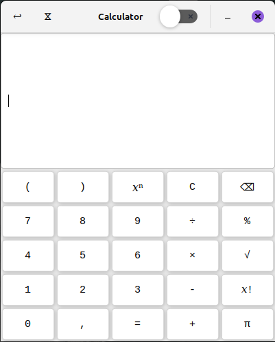
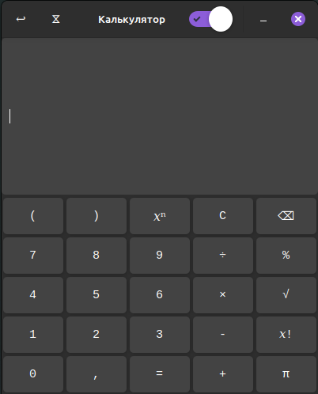

# GTK3 Calculator




# 🇺🇸 ENG 

## About ##

Another calculator that no one needed, implemented as part of my personal 1st learning project. It was written in C++ using the GTK3 library.

You can try it by downloading the package from the [Release](https://github.com/surfpunkk/Calculator-GTK3/releases).

## Linux ##

> [!CAUTION]
For now, the application is only supported on Debian-based systems.

**Download the package and install it (Dependencies may need to be installed):**

```bash
dpkg -i gtk3-calculator-*.deb
```

**Done! You can run it from the terminal with the command:**

```bash
$ calculator-gtk3
```

**Or find the programm in the menu.**

## Windows ##

**Maybe later :)**

## Compiling ##

**So you can compile it yourself by cloning the project first:**

```bash
git clone https://github.com/surfpunkk/Calculator
```

**Next, you should to make a directory in the cloned project and build app using CMakeList.txt (you must have CMake (>=3.30), GTK3, ICU, Ninja, pkg-config installed):**

```bash
mkdir build && cmake -B build -G Ninja
```

**Then forward to directory build and run ninja:**

```bash
cd build/ && ninja
```

# 🇷🇺 RU 

## О проекте ##

Ещё один калькулятор, который никому не нужен, реализованный в рамках моего личного первого учебного проекта. Он написан на C++ с использованием библиотеки GTK3.

Вы можете опробовать приложение, скачав пакет из [Release](https://github.com/surfpunkk/Calculator-GTK3/releases).

## Linux ##

> [!CAUTION]
На данный момент приложение поддерживается только в Debian-подобных системах.

**Скачайте и установите пакет командой (Может потребоваться установить зависимости):**

```bash
dpkg -i gtk3-calculator-*.deb
```

**Готово! Вы можете запустить приложение из терминала с помощью команды:**

```bash
$ calculator-gtk3
```

**Или найдите программу в меню.**

## Windows ##

**Может быть попозже :)**

## Компиляция ##

**Для самостоятельной компиляции сначала клонируйте проект:**

```bash
git clone https://github.com/surfpunkk/Calculator
```

**Далее необходимо создать каталог в склонированном проекте и собрать приложение с помощью CMakeList.txt (у вас должны быть установлены CMake (>=3.30), GTK3, ICU, Ninja, pkg-config):**

```bash
mkdir build && cmake -B build -G Ninja
```

**Затем перейдите в каталог build и запустите ninja:**

```bash
cd build/ && ninja
```
